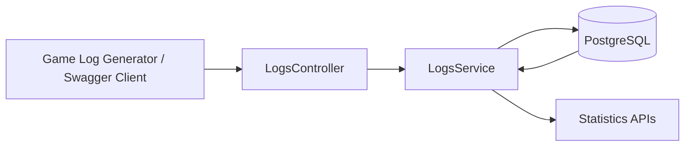

## Architecture

```mermaid
flowchart LR
    A[Game Log Generator / Swagger Client] --> B[LogsController]
    B --> C[LogsService]
    C --> D[(PostgreSQL)]
    D --> C
    C --> E[Statistics APIs]
```
