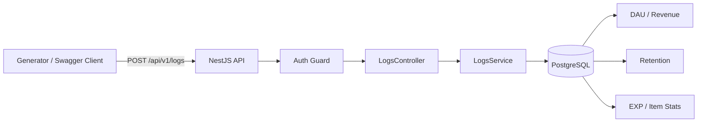

# 문제 1. 게임 로그 적재 파이프라인 설계

## 1. 설계 목적

이번 과제에서는 게임에서 발생하는 로그를 HTTP로 수집하고,  
이를 안정적으로 저장한 뒤 이후 집계 API에서 바로 활용할 수 있는 형태로 관리하는 것을 목표로 했습니다.

구현하면서 가장 중요하게 본 부분은 아래 세 가지였습니다.

- 로그를 한 건씩이 아니라 **배치로 안정적으로 전송하고 적재할 것**
- 재전송이나 지연 상황을 고려해 **중복 로그와 비순차 로그를 처리할 것**
- 이후 문제 2에서 필요한 **DAU, 매출, 리텐션 집계에 유리한 저장 구조를 만들 것**

즉, 이번 설계는 단순히 “로그를 받는다”보다  
**전송 → 수신 → 검증 → 저장 → 집계 준비** 흐름 전체를 기준으로 잡았습니다.

---

## 2. 요구사항 해석

제가 이해한 핵심 요구사항은 아래와 같았습니다.

- 로그는 **HTTP API** 로 수집해야 한다.
- 여러 로그를 묶어서 보내는 **배치 전송**이 가능해야 한다.
- **인스턴스당 분당 120회 요청 제한**을 지켜야 한다.
- 요청 body는 **최대 4MB**를 넘기면 안 된다.
- 요청이 너무 오래 걸리지 않도록 **30초 이내 처리/타임아웃**을 고려해야 한다.
- 네트워크 재시도 등으로 **중복 로그가 들어올 수 있다.**
- 로그가 발생한 순서와 도착한 순서가 다를 수 있으므로 **비순차 로그 처리**가 필요하다.
- 저장 구조는 이후 **집계/조회 API에 유리해야 한다.**

이 조건을 기준으로 보면 설계에서 중요한 포인트는 크게 세 가지입니다.

1. **전송 단계에서 요청 수와 배치 크기를 제어할 것**
2. **서버 단계에서 인증, 검증, 중복 처리를 할 것**
3. **DB는 원본 보존과 집계 조회를 함께 고려해서 설계할 것**

---

## 3. 전체 구조

전체 구조는 가능한 한 단순하게 가져갔습니다.

**Generator / Swagger Client → NestJS 적재 API → PostgreSQL 저장 → 집계 API 조회**



이번 과제에서는 범위에 맞게 **HTTP 수집 + DB 저장** 흐름을 명확하게 만드는 데 집중했습니다.

구조 자체는 단순하지만, 그 안에서 아래 항목은 분명하게 처리하는것을 우선으로 설계했습니다.

- 인증
- 요청 형식 검증
- 배치 적재
- 중복 방지
- 비순차 로그 처리
- 집계용 인덱스 설계

---

## 4. 데이터 흐름 기준 설계

이번 문서에서는 실제 구현 구조와 연결되도록,  
데이터가 이동하는 순서대로 각 파일의 역할을 정리했습니다.

### 4-1. 로그 생성과 배치 구성

전송 쪽은 generator 폴더를 기준으로 구성했습니다.

#### `generator/index.ts`

전송 흐름의 시작점입니다.  
전체 실행을 담당하는 파일로, 사용자별 로그 생성, 배치 구성, 전송 호출을 연결합니다.

이 파일에서는 주로 아래 역할을 맡습니다.

- 실행 진입점
- 전체 사용자/이벤트 생성 루프 관리
- 배치 단위로 로그를 묶는 흐름 제어
- sender 모듈 호출

즉, 세부 로직을 다 처리하기보다는  
**전체 전송 흐름을 조립하는 역할**에 가깝습니다.

#### `generator/helpers.ts`

실제 게임 로그 데이터를 만드는 로직을 모아둔 파일입니다.

예를 들면 아래 같은 작업이 여기 들어갑니다.

- 가입일 생성
- 접속 이벤트 분포 생성
- 레벨/경험치/결제 같은 이벤트 데이터 구성
- 유저 상태를 기준으로 이벤트 타입 결정

이 파일은 “무엇을 보낼지”를 만드는 쪽이고,  
전송 자체보다는 **도메인 데이터 생성**에 집중합니다.

#### `generator/utils.ts`

날짜 계산이나 랜덤 보조 함수처럼  
여러 곳에서 공통으로 쓰는 작은 함수들을 모아둔 파일입니다.

예:

- 날짜 시작 시각 계산
- 일 수 차이 계산
- 범용 랜덤 보조 함수

이렇게 분리해두면 `index.ts`나 `helpers.ts`가 덜 길어지고,  
로직도 읽기 쉬워집니다.

#### `generator/constants.ts`

전송 제약이나 고정값을 모아둔 파일입니다.

예:

- 최대 요청 수
- 최대 body 크기
- 타임아웃
- 기본 배치 크기
- 이벤트 타입 상수

이 파일을 따로 둔 이유는 조건이 바뀌더라도  
코드 여러 군데를 직접 수정하지 않도록 하기 위해서입니다.

#### `generator/types.ts`

로그 데이터 형태와 공통 타입을 정의하는 파일입니다.

예:

- 로그 객체 타입
- 이벤트 타입
- 전송 요청/응답 타입

이 파일이 있으면 생성 단계와 전송 단계에서  
같은 구조를 기준으로 맞출 수 있어서 실수를 줄이기 좋습니다.

---

### 4-2. 실제 전송 처리

#### `generator.sender.ts`

배치로 묶인 로그를 실제 HTTP 요청으로 보내는 파일입니다.

이 파일에서는 과제의 전송 제약을 직접 반영했습니다.

- **인스턴스별 120 req/min 제한**
- **4MB 이하로 배치 크기 조절**
- **30초 이내 타임아웃**
- 실패 시 재시도 처리
- 재시도 상황에서도 같은 `event_id`를 유지해 중복 방지 가능하도록 설계

즉, 이 파일이 전송 단계에서 가장 중요한 역할을 합니다.  
단순 POST 호출이 아니라, **요구사항을 실제로 지키게 만드는 계층**이라고 볼 수 있습니다.

---

### 4-3. 서버 수신과 검증

전송된 로그는 NestJS API에서 받습니다.

#### `Auth Guard`

가장 앞단에서 인증 헤더를 검사합니다.  
인증에 실패하면 적재 로직으로 넘기지 않고 바로 차단합니다.

#### `LogsController`

`POST /api/v1/logs` 엔드포인트를 받고,  
요청 body를 서비스 계층으로 전달하는 역할을 합니다.

여기서는 요청 진입점 역할을 하고,  
복잡한 비즈니스 로직은 서비스로 넘깁니다.

#### `LogsService`

실제 적재 로직을 담당합니다.

주요 역할은 아래와 같습니다.

- 요청 데이터 검증
- 로그 단위 필수 필드 확인
- 중복 이벤트 처리
- DB 저장 호출
- 처리 결과 응답 구성
- 중복 이벤트 확인 및 DB 유니크 제약 기반 저장 처리

즉, 적재 파이프라인에서 핵심 로직은 서비스 계층에 모이도록 했습니다.

---

### 4-4. 저장 단계

#### `game_logs` 테이블

최종 로그 저장소입니다.  
여기서는 원본 로그를 최대한 보존하면서도,  
집계에 필요한 공통 필드는 쉽게 조회할 수 있도록 설계했습니다.

특히 아래 두 값을 분리한 점이 중요합니다.

- `occurred_at`: 실제 이벤트 발생 시간
- `created_at`: 서버에 적재되어 DB에 저장된 시간

이렇게 해야 늦게 도착한 로그가 있어도  
집계는 `occurred_at` 기준으로 정확하게 처리할 수 있습니다.

---

## 5. 적재 API 설계

### 엔드포인트

```http
POST /api/v1/logs
```

로그는 여러 이벤트를 묶어서 보내는 **배치 방식**으로 받습니다.

예시:

```json
{
  "logs": [
    {
      "event_id": "evt_001",
      "instance_id": "instance-a",
      "user_id": "user_101",
      "event_type": "LOGIN",
      "occurred_at": "2026-07-25T10:00:00Z",
      "payload": {}
    }
  ]
}
```

### 인증

헤더 기반 인증을 사용합니다.

```http
Authorization: Bearer <token>
```

### 제약 조건 반영

- 인스턴스당 **120 req/min**
- 요청 body **최대 4MB**
- 요청 **30초 이내 처리**
- 운영 기준 포트는 **80 / 443**, 실제 서비스는 **HTTPS(443)** 사용 전제

### 에러 처리

- `400 Bad Request` : 요청 형식 오류, 필수 필드 누락
- `401 Unauthorized` : 인증 실패
- `413 Payload Too Large` : 본문 크기 초과
- `429 Too Many Requests` : 요청 수 초과
- `500 Internal Server Error` : 서버 내부 오류

---

## 6. 중복 로그와 비순차 로그 처리

### 중복 로그

네트워크 재시도나 응답 유실 때문에 같은 로그가 다시 들어올 수 있으므로,  
`event_id`를 기준으로 중복을 막도록 했습니다.

- 전송 시 각 로그에 고유한 `event_id` 부여
- DB에서 `event_id`에 유니크 제약 적용

이렇게 하면 같은 이벤트가 다시 들어와도  
중복 저장되지 않습니다.

### 비순차 로그

로그는 항상 순서대로 도착하지 않기 때문에  
저장 시각이 아니라 **실제 발생 시각(`occurred_at`) 기준**으로 집계할 수 있어야 합니다.

그래서 DB에는 `occurred_at`과 `created_at`을 따로 저장했습니다.

---

## 7. 저장 스키마 설계

집계에 자주 쓰는 값은 컬럼으로 두고,  
이벤트별 상세 데이터는 `payload(JSONB)`에 넣는 구조로 설계했습니다.

```sql
CREATE TABLE game_logs (
    event_id      UUID PRIMARY KEY,
    instance_id   VARCHAR(255) NOT NULL,
    event_type    VARCHAR(50) NOT NULL,
    user_id       INT NOT NULL,
    character_id  INT NULL,
    session_id    VARCHAR(255) NULL,
    channel_id    VARCHAR(255) NULL,
    payload       JSONB NOT NULL,
    occurred_at   TIMESTAMPTZ NOT NULL,
    created_at    TIMESTAMPTZ NOT NULL DEFAULT NOW()
);

```

## 8. 집계 API 연계 방향

이 저장 구조는 문제 2의 집계 API에서도 바로 활용할 수 있도록 설계했습니다.  
핵심은 `occurred_at`, `event_type`, `user_id` 같은 공통 컬럼을 기준으로 조회하고,  
이벤트별 상세 값은 `payload`에서 읽는 방식입니다.

예를 들면 아래와 같은 집계 API로 자연스럽게 연결할 수 있습니다.

- **DAU 조회**
  - 특정 날짜에 활동한 유저 수를 `COUNT(DISTINCT user_id)`로 계산
- **매출 조회**
  - `event_type = PURCHASE` 조건으로 결제 로그를 조회하고 `payload`의 금액 값을 합산
- **리텐션 조회**
  - 가입일 또는 첫 활동일 기준으로 코호트를 나누고, 이후 재방문 여부를 `user_id`와 `occurred_at` 기준으로 계산

즉, 문제 1의 저장 구조는 단순 적재용이 아니라  
문제 2의 집계 API에서 바로 사용할 수 있도록 공통 조회 조건을 컬럼으로 분리해 둔 구조입니다.

## 9. 트레이드오프

이번 설계에서는 주어진 제약 안에서 구현 복잡도와 안정성 사이의 균형을 맞추는 쪽으로 판단했습니다.

### 1) 메시지 큐 없이 HTTP → DB 구조로 간 이유

대규모 트래픽만 생각하면 Kafka 같은 큐를 두는 편이 확장성에는 유리합니다.  
다만 이번 과제에서는 HTTP 적재 API 설계 자체와 전송 제약 처리(120 req/min, 4MB, 30초)가 핵심이었기 때문에,  
먼저 **직접 수신 후 저장하는 단순한 구조**로 가져갔습니다.

이 선택의 장점은 흐름이 단순해서 구현과 검증이 쉽다는 점입니다.  
반면, 트래픽이 더 커지면 버퍼링이나 비동기 처리가 부족할 수 있다는 한계는 있습니다.

### 2) 이벤트별 테이블 분리 대신 단일 로그 테이블을 사용한 이유

이벤트별로 테이블을 나누면 스키마를 더 엄격하게 관리할 수 있지만,  
적재 API가 복잡해지고 이벤트 종류가 늘어날 때 유지보수 비용이 커집니다.

이번 과제에서는 여러 종류의 게임 로그를 하나의 API로 배치 수집하는 구조가 더 중요하다고 봤기 때문에,  
공통 필드는 컬럼으로 두고 상세 데이터는 `payload(JSONB)`에 넣는 방식을 선택했습니다.

이 방식은 적재 구조를 단순하게 만들 수 있다는 장점이 있지만,  
이벤트별 상세 분석에서는 JSON 필드 의존도가 높아질 수 있습니다.

### 3) 중복 처리를 애플리케이션 로직만이 아니라 DB 제약으로 보장한 이유

재시도 상황에서는 같은 로그가 다시 들어올 수 있기 때문에  
중복 제거를 코드에서만 처리하면 누락 가능성이 있습니다.

그래서 `event_id`를 기준으로 DB에 유니크 제약을 두어  
멱등성을 저장소 레벨에서도 보장하도록 했습니다.

이 선택은 안정성 면에서는 유리하지만,  
모든 이벤트에 고유 ID를 부여하고 관리해야 한다는 전제가 필요합니다.

### 4) 수신 순서보다 발생 시각 기준으로 집계 가능하게 한 이유

로그는 항상 순서대로 도착하지 않기 때문에  
저장 시각만 기준으로 보면 DAU나 리텐션 계산이 왜곡될 수 있습니다.

그래서 `occurred_at`을 기준으로 실제 이벤트 시간을 저장하고,  
`created_at`은 적재 시각으로 따로 관리하도록 했습니다.

이 방식은 집계 정확도에 유리하지만,  
조회 시 어떤 시간을 기준으로 볼지 명확히 구분해서 사용해야 합니다.

## 10. 정리

이번 설계의 핵심은 아래와 같습니다.

- 로그는 **HTTP 배치 방식**으로 수집.
- generator 구조를 분리해서 **생성 / 공통 유틸 / 전송 책임**을 분리.
- 전송 단계에서 **120 req/min, 4MB, 30초 제한**을 지키도록 설계.
- 서버는 **인증, 요청 검증, 중복 방지, 예외 처리**를 담당.
- 저장소는 **`event_id` 기반 중복 방지**와 **`occurred_at` 기준 집계**를 지원하도록 설계.

이번 과제에서는 클라우드 배포 구성까지 확장하기보다는, 주어진 조건 안에서 로그 적재 API와 저장 구조를 명확하게 설계하는 데 집중했습니다.
